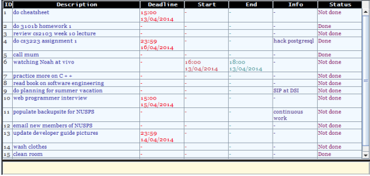

# Just Type your To-Dos

TaskPad is a typing based desktop to-do manager. It is developed as part of CS2103T Software Engineering Project.

Download
=======
Our TaskPad V0.5 Beta is out!
Simply download [TaskPad](TaskPad_v0.5.jar) and run it to try it!

Works for both Windows and Mac.

Usage 
======
For detailed list of commands see [Command Syntax](./Wikis/CommandSyntax.md). For a list of Hot Keys that can be used with our program, see [Hot Keys](./Wikis/HotKeys.md)

Video Links
======
Click on the following links to watch Promotional videos on the project!

[TaskPad Demo Video by Lynnette](http://www.youtube.com/watch?v=Y7H9xLMvUAY)

[TaskPad Demo Video  by Taining](http://www.youtube.com/watch?v=zV1UXhrFMH4)

[TaskPad Demo Video  by Jun Wei](http://www.youtube.com/watch?v=-274ZY7OaP8)

[TaskPad functionalities & Automated GUI Testing](https://youtu.be/iLVhcp0llNs)

Please give us comments :)
=======

